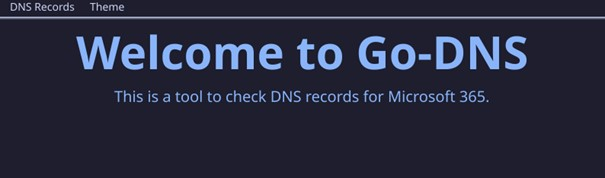

# Go DNS

> [!NOTE]
> Download the latest version from the [release page](https://github.com/HRA42/Go-DNS/releases) and run the executable.

This app is written to make it super easy to get all relevant dns entries from a domain.

---
## Features

The App asks the following dns servers:
- [x] `Google (8.8.8.8)`
- [x] `Cloudflare (1.1.1.1)`
- [x] `Quad9 (9.9.9.9)`  

For the following dns entries:
- [x] `CNAME Entries`:
  - [x] `autodiscover`
  - [x] `lyncdiscover`
  - [x] `selector1._domainkey`
  - [x] `selector2._domainkey`
- [x] `MX Entries`
- [x] `TXT Entries`

It can also check the ssl status of a domain.

---

## Packaging
You need to set up [Fyne](https://developer.fyne.io/started/)
After that you can clone the repository and run `fyne package` to build the app.  
Don't forget to change the metadata in [FyneApp.toml](FyneApp.toml).

---

## Preview
### Light Mode

### Dark Mode

---

## Codesandbox

